## Grandma’s Chocolicious

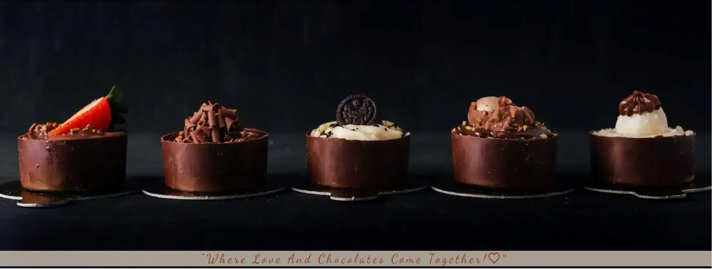

**Description**

"Welcome to **Grandma's Chocolicious**, a website made with love for chocolate lovers! Explore a world of irresistible homemade chocolates, handcrafted with care and devotion by a **passionate grandmother**.”

## Project Goal:

In simple terms, my goal is to show my skills in using HTML and CSS to create a website that looks great on any device. I want to impress with a responsive design and a seamless user experience. The website will be a sweet and delightful place that reflects the passion of a grandmother for chocolates.

## User Experience (UX) Development

**New User:**

- **Easy Navigation**: I want to explore the website effortlessly and quickly find information about the grandmother's delightful chocolates and treats.
  
- **Online Chocolate Experience**: I'm eager to enjoy the delectable chocolates online through a seamless and delightful virtual experience.
  
- **Discover More**: I want to know more about the grandmother's love for chocolates, her unique recipes, and the story behind her passion.
  
- **Sign Up for Sweet Surprises**: I'm excited to sign up and receive updates about new chocolate creations, limited editions, and special discounts.
  
- **Connect on Social Media**: I wish to connect with the website's social media platforms to stay updated on the latest chocolate surprises and events.
  

**Returning Users:**

- **Discover Chocolates**: Learn about a variety of delicious chocolates crafted with love by the grandma.
  
- **Contact Us**: Easily get in touch with the chocolate grandma for any questions or feedback.
  

**Target Audience:**

This website is for all chocolate enthusiasts, especially those who adore homemade chocolates made with love by a passionate grandmother. It welcomes people of all ages who appreciate the art of chocolate-making and the joy of savoring delightful treats.

## Design choices

**Typography**

- **Headings**:  the font type chosen was: font-family: 'Dancing Script', cursive, sans-serif;
  

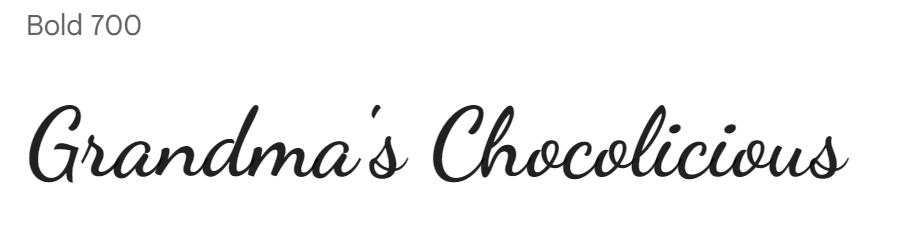

- **Body**: the font type selected was: font-family: 'Barlow Condensed', sans-serif;
  

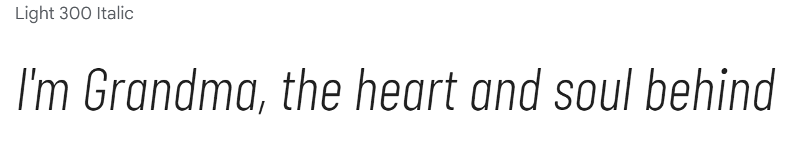

Both styles through https://fonts.google.com

I made sure the fonts on the website go together well by using the website https://www.fontpair.co/all. This tool helped me choose fonts that work nicely together, making the site look better.

**Colour Scheme**

The website, centered around the theme of a chocolate-loving grandmother. The colors #8d4925 and rgba(237, 222, 207) and color white were chosen to resonate with the essence of content.

I choose the rgba(237, 222, 207) color scheme, adjusting the opacity in the range of 0.5 to 1 to achieve the most suitable visual outcome.
These colors work together to bring our website to life, reminding users of the joy of sharing delicious chocolates and the warmth of family connections.

https://paletadecolores.online/en/html-colors/brown/

https://www.canva.com/pt_br/aprenda/cores-para-sites-50-paginas-impactantes/

**Imagery**

All the pictures were picked to match the theme of the website. The images were chosen from free image using the website https://www.pexels.com .

**Site layout**
  
The website layout features a header with the logo and navigation menu. It comprises three sections: "Our Product," "About Us," and "Contact Us." Additionally, there's a page to express gratitude for visiting the site and for signing up. Furthermore, the website includes a footer containing links to our social media profiles, allowing easy connection and interaction.

**Wireframe**

The wireframe was made using a tool called Balsamiq. This tool helped create an early look at the website before actually building it. This made it easier to organize how things would look and where pictures and content would go. It also helped make sure everything looks nice on different devices like phones and computers.

(Add image dasktop)

(Add image tablet)

(add image mobile)

## Features

- **Home Page**: Crafted with product photos to captivate customer attention and create an engaging user experience.
  

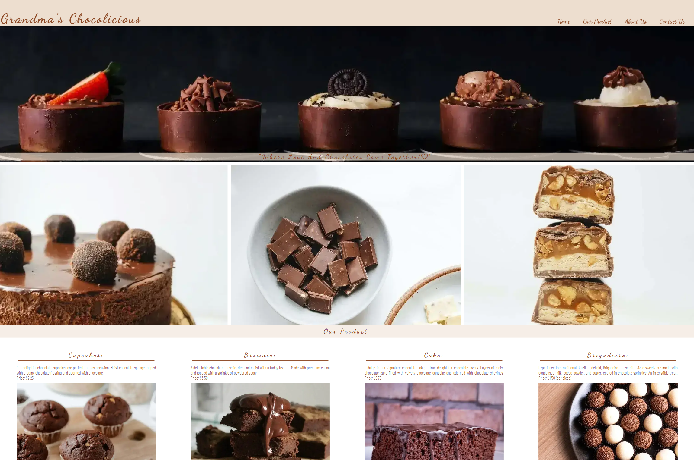

- **Header**: Includes a logo and links for easy navigation on the website.
  

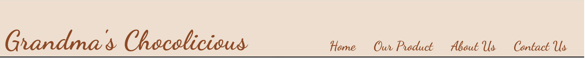

- **Our Product section**: Where you'll find photos and descriptions of the products we offer.

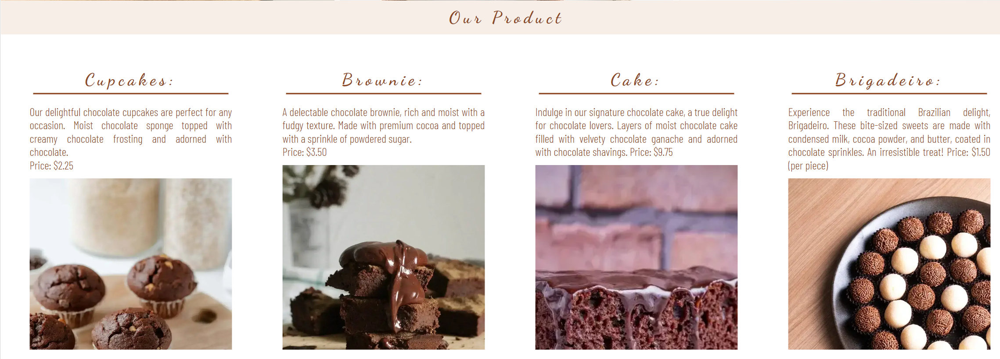

- **Contact Section**: Here, you'll discover a map showing our location, as well as a form for signing up to get a 20% discount and receive email updates.
  

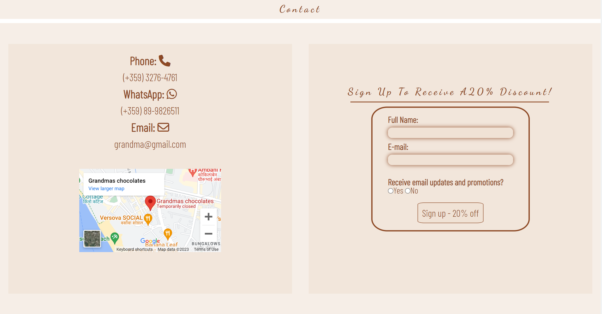

- **Footer**: Links to all our social media accounts like Instagram, YouTube, and Twitter.
  

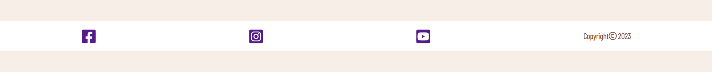

- **Thank You Page**: A message thanking you for signing up and visiting our website.

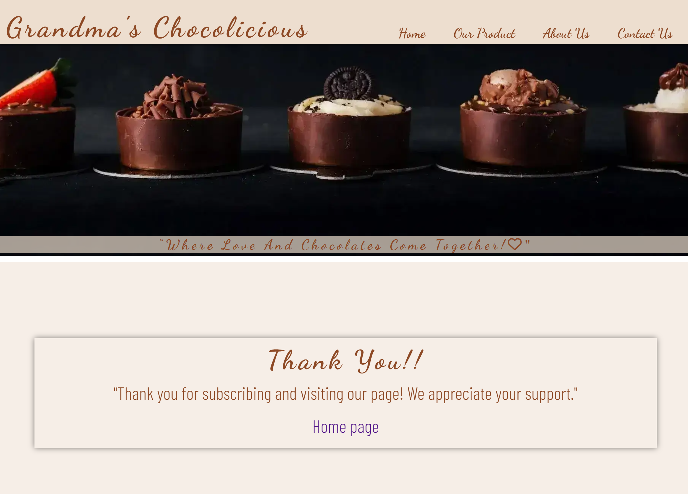

- **Favicon**: An icon for the browser tab.
  

## Technologies Used

**Languages Used**

- HTML
- CSS

**Framework, Libraries and Programs:**

- **Balsamiq:** Used for creating wireframes.

- **GitHub:** Used for website deployment.

- **Gitpod:** Used for managing versions and team collaboration.

- **Font Awesome:** A library of icons and symbols used for the webpage. <https://fontawesome.com/>

- **Google Fonts:** Imported fonts for the website. https://fonts.google.com/

- **Pexels:** Source of all the downloaded photos. <https://www.pexels.com>

- **Paint:** Used to edit screenshots and convert image extensions for the readme file.

- **Font-Pair:** Utilized to find matching fonts. https://www.fontpair.co/all

- **Am I responsive:** Used to check how the website responds on various screens. <https://ui.dev/amiresponsive>

- **Chrome Dev Tools:** Frequently used to experiment with code and preview on different screens.

- **stackedit.io:** Used for editing and styling the Readme file. <https://stackedit.io/>

- **tinypng.com:** Used for compressing and optimizing images to improve performance. <https://tinypng.com/>

## Testing

- **HTML Validation**: <https://validator.w3.org/>

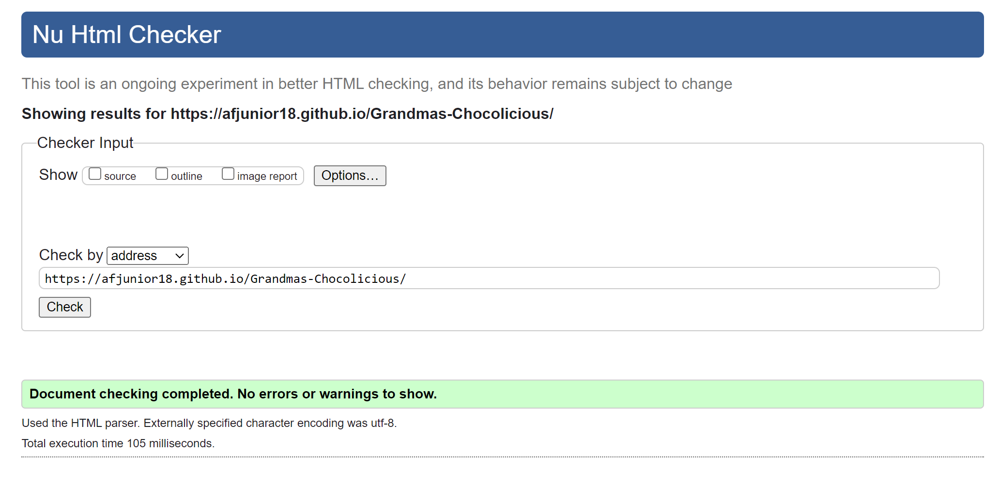

- **CSS Validation**: <https://jigsaw.w3.org/css-validator/>

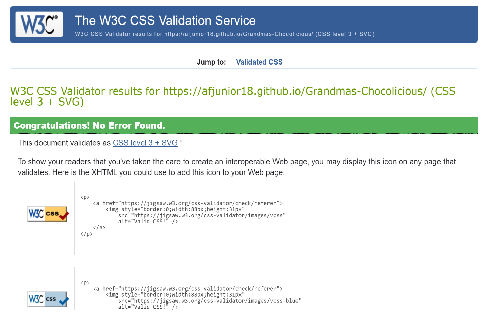

**Lighthouse tool**:

We used Lighthouse in DevTools to assess and optimize the performance, accessibility, best practices, SEO, and Progressive Web App (PWA) aspects of a web page.

- **Dasktop - Index.html**
  
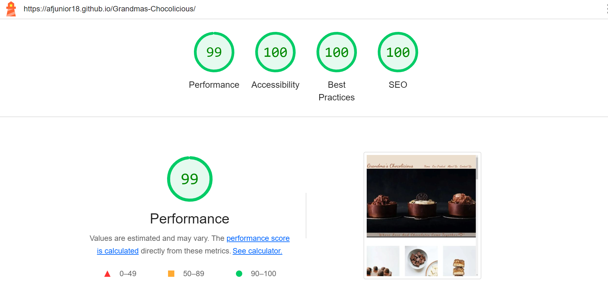

- **Mobile - Index.html**

- **Dasktop - thank-you.html**
  
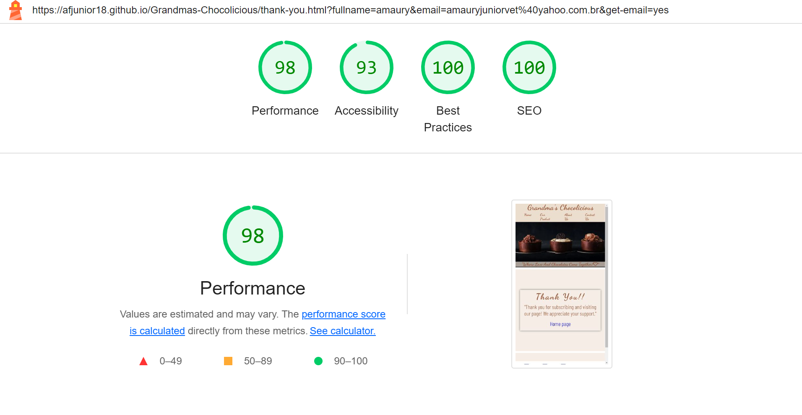

- **Mobile - thank-you.html**

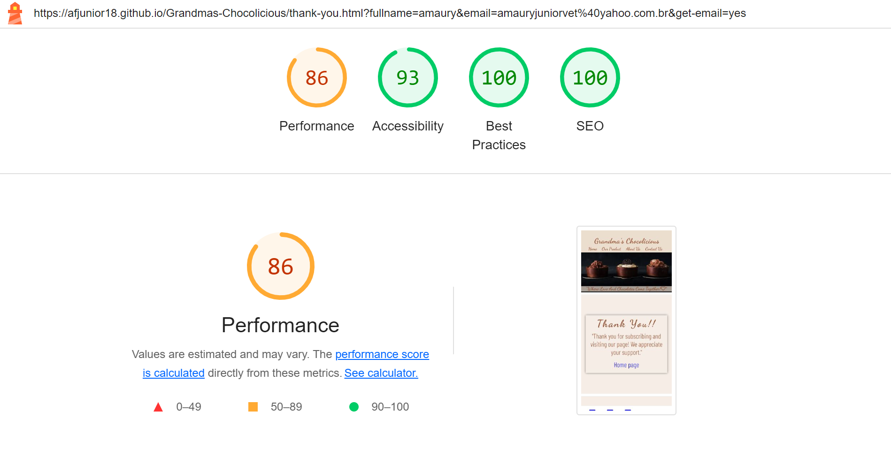

