## Grandma’s Chocolicious

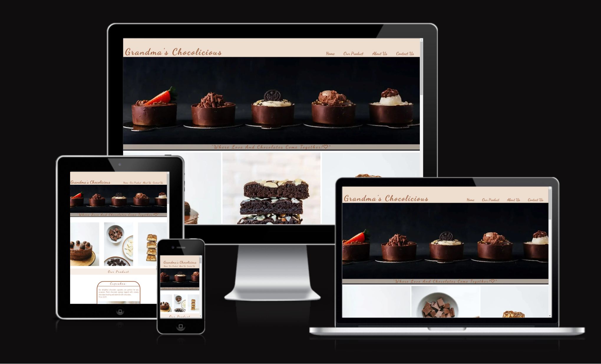

"**Grandma's Chocolicious**, a website made with love for chocolate lovers! Explore a world of irresistible homemade chocolates, handcrafted with care and devotion **by a passionate grandmother**.”

[**Live Website: Grandmas-Chocolicious**](https://afjunior18.github.io/Grandmas-Chocolicious/)

## Content
- [Grandma’s Chocolicious](#grandmas-chocolicious)
- [Content](#content)
- [Project Goal](#project-goal)
- [User Experience (UX) Development](#user-experience-ux-development)
  - [New User](#new-user)
  - [Returning Users](#returning-users)
  - [Target Audience](#target-audience)
- [Design choices](#design-choices)
  - [Typography](#typography)
  - [Colour Scheme](#colour-scheme)
  - [Imagery](#imagery)
  - [Site layout](#site-layout)
  - [Wireframe](#wireframe)
- [Features](#features)
  - [Home Page](#home-page)
  - [Header](#header)
  - [Our Product section](#our-product-section)
  - [Contact Section](#contact-section)
  - [Footer](#footer)
  - [Thank You Page](#thank-you-page)
  - [Favicon](#favicon)
- [Technologies Used](#technologies-used)
  - [Languages Used](#languages-used)
  - [Framework, Libraries and Programs](#framework-libraries-and-programs)
- [Testing](#testing)
  - [HTML Validation](#html-validation)
  - [CSS Validation](#css-validation)
  - [Lighthouse tool](#lighthouse-tool)
  - [Wave Validation](#wave-validation)
- [Deployment](#deployment)
- [Credits](#credits)
- [Media and Content](#media-and-content)

## Project Goal

In simple terms, my goal is to show my skills in using HTML and CSS to create a website that looks great on any device. The website will be a sweet and delightful place that reflects the passion of a grandmother for chocolates.

## User Experience (UX) Development

### New User

- #### Easy Navigation: 
As a New user I want to explore the website effortlessly and quickly find information about the grandmother's delightful chocolates and treats.

**Testing**: The website comprises three sections that are easy to access through our top navigation menu located at the top of the page.
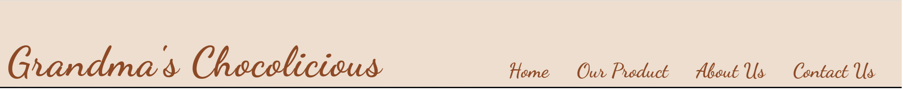

- #### Sign Up for Sweet Surprises: 
As a New user I want to sign up and receive updates about new chocolate creations, limited editions, and special discounts.

**Testing**: In the "Contact" section, there's a form for new users. By filling out this form, users receive a 20% discount and also subscribe to our newsletters, where they'll receive updates about our products.
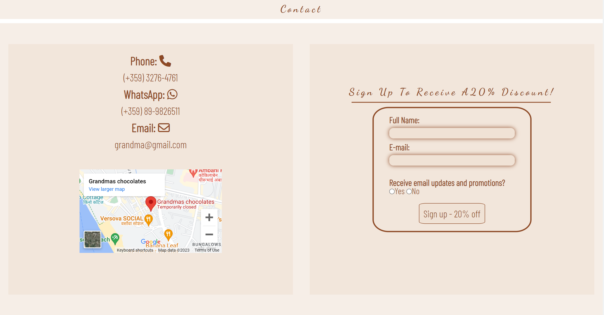

- #### Connect on Social Media: 
As a New user I want to connect with the website's social media platforms to stay updated on the latest chocolate surprises and events.

**Testing**: You can find all our social media links in the footer at the bottom of the page. Simply click on the links to be directed to your desired social media platform.
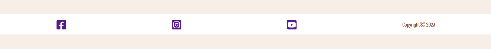
  
### Returning Users

- #### Discover Chocolates: 
Learn about a variety of delicious chocolates crafted with love by the grandma.
  
- #### Contact Us: 
Easily get in touch with the chocolate grandma for any questions or feedback.
  
### Target Audience

This website is for all chocolate enthusiasts, especially those who adore homemade chocolates made with love by a passionate grandmother. It welcomes people of all ages who appreciate the art of chocolate-making and the joy of savoring delightful treats.

## Design choices

### Typography

- #### Headings: 
The font type chosen was: font-family: 'Dancing Script', cursive, sans-serif;
  
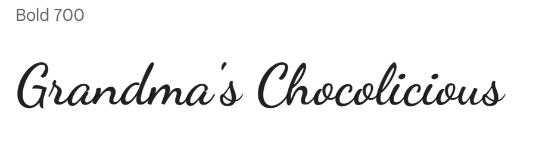

- #### Body: 
The font type selected was: font-family: 'Barlow Condensed', sans-serif;
  

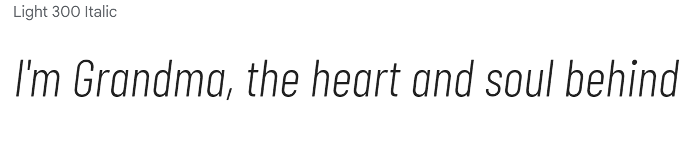

Both styles through https://fonts.google.com

I made sure the fonts on the website go together well by using the website https://www.fontpair.co/all. This tool helped me choose fonts that work nicely together, making the site look better.

### Colour Scheme

The website, centered around the theme of a chocolate-loving grandmother. The colors #8d4925 and rgba(237, 222, 207) and color white were chosen to resonate with the essence of content.

I choose the rgba(237, 222, 207) color scheme, adjusting the opacity in the range of 0.5 to 1 to achieve the most suitable visual outcome.
These colors work together to bring our website to life, reminding users of the joy of sharing delicious chocolates and the warmth of family connections.

https://paletadecolores.online/en/html-colors/brown/

https://www.canva.com/pt_br/aprenda/cores-para-sites-50-paginas-impactantes/

### Imagery 

All the pictures were picked to match the theme of the website. The images were chosen from free image using the website https://www.pexels.com .

### Site layout
  
The website layout features a header with the logo and navigation menu. It comprises three sections: "Our Product," "About Us," and "Contact Us." Additionally, there's a page to express gratitude for visiting the site and for signing up. Furthermore, the website includes a footer containing links to our social media profiles, allowing easy connection and interaction.

### Wireframe

The wireframe was made using a tool called Balsamiq. This tool helped create an early look at the website before actually building it. This made it easier to organize how things would look and where pictures and content would go. It also helped make sure everything looks nice on different devices like phones and computers.

- **Desktop - Wireframe**
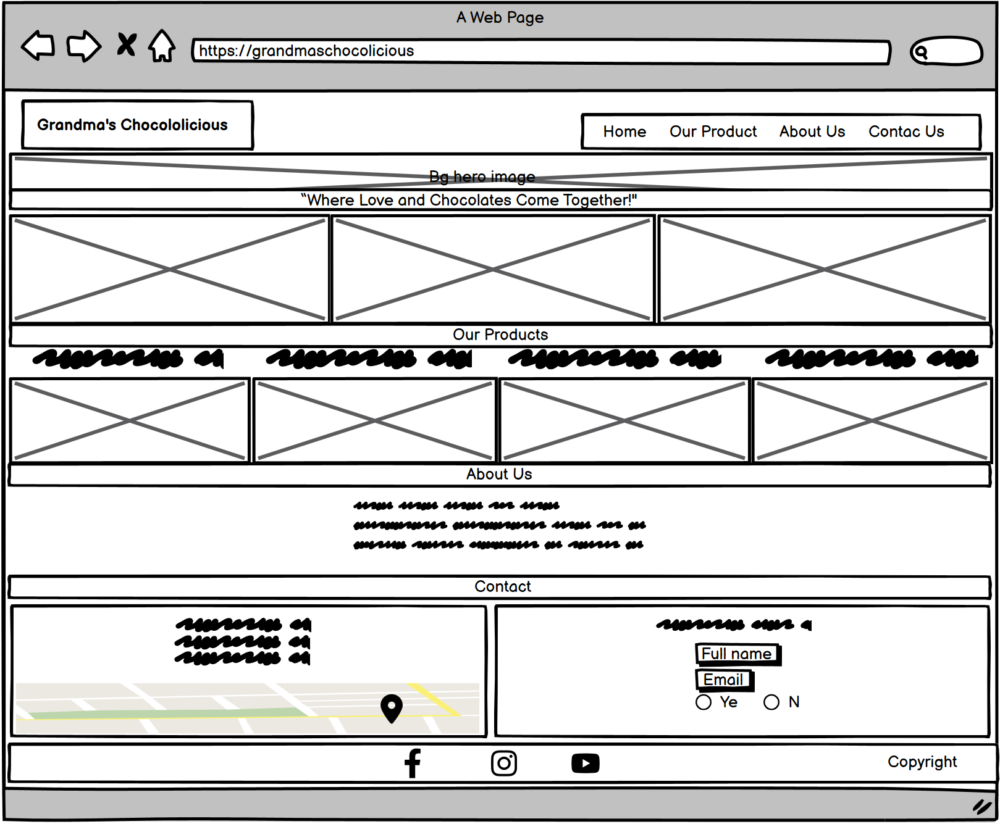

- **Tablet - Wireframe**

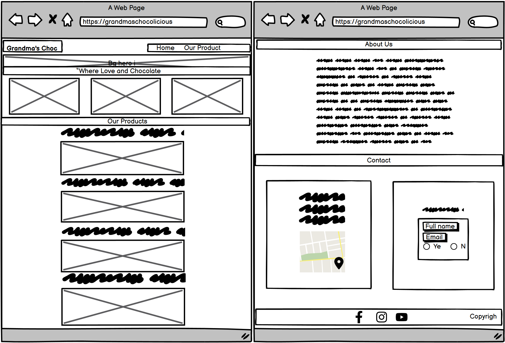

- **Mobile - Wireframe**

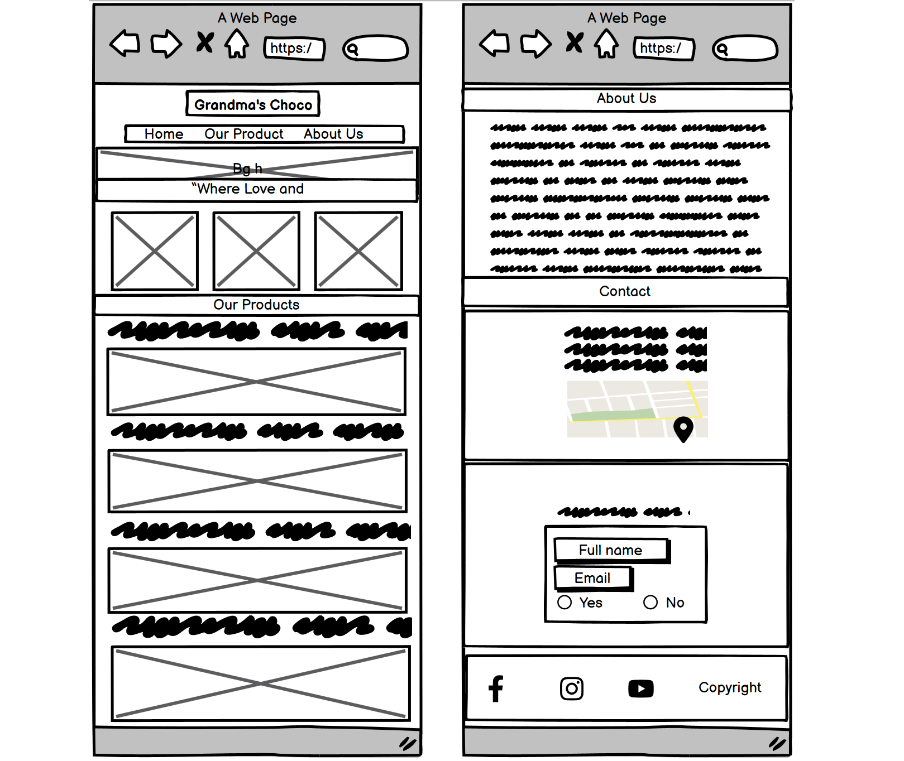

## Features

### Home Page
- Crafted with product photos to captivate customer attention and create an engaging user experience.
  

### Header
- Includes a logo and links for easy navigation on the website.
  

### Our Product section
- Where you'll find photos and descriptions of the products we offer.

### Contact Section
- Here, you'll discover a map showing our location, as well as a form for signing up to get a 20% discount and receive email updates.
  

### Footer
- Links to all our social media accounts like Instagram, YouTube, and Twitter.
  

### Thank You Page
- A message thanking you for signing up and visiting our website.

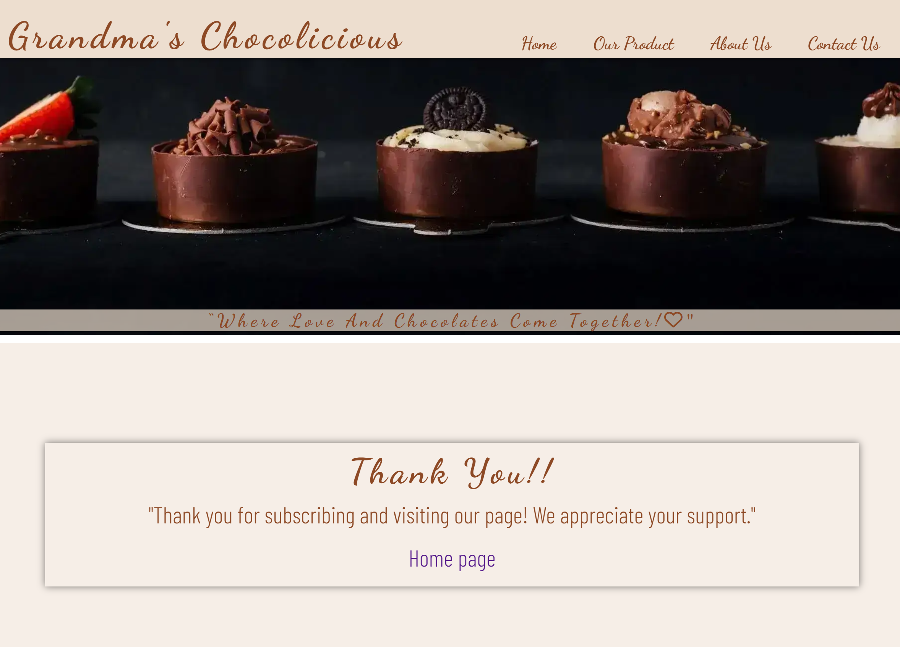

### Favicon
- An icon for the browser tab.
  

## Technologies Used

### Languages Used

- HTML
- CSS

### Framework, Libraries and Programs

- **Balsamiq:** Used for creating wireframes. https://balsamiq.com/

- **GitHub:** Used for website deployment. https://github.com/

- **Gitpod:** Used for managing versions and team collaboration.

- **Font Awesome:** A library of icons and symbols used for the webpage. https://fontawesome.com/

- **Google Fonts:** Imported fonts for the website. https://fonts.google.com/

- **Pexels:** Source of all the downloaded photos. https://www.pexels.com

- **Paint:** Used to edit screenshots and convert image extensions for the readme file.

- **Font-Pair:** Utilized to find matching fonts. https://www.fontpair.co/all

- **Am I responsive:** Used to check how the website responds on various screens. https://ui.dev/amiresponsive

- **Chrome Dev Tools:** Frequently used to experiment with code and preview on different screens.

- **stackedit.io:** Used for editing and styling the Readme file. https://stackedit.io/

- **tinypng.com:** Used for compressing and optimizing images to improve performance. https://tinypng.com/

## Testing

### HTML Validation
- <https://validator.w3.org/>

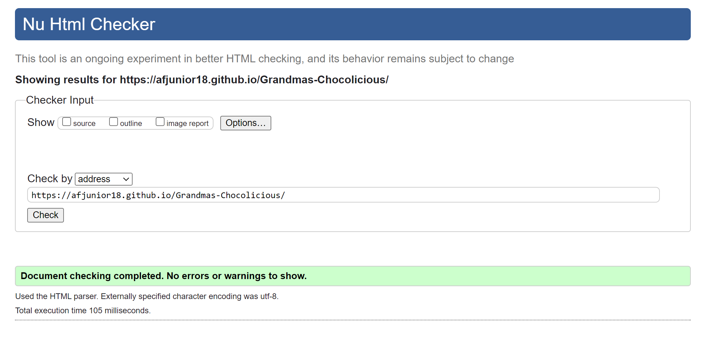

### CSS Validation 
- <https://jigsaw.w3.org/css-validator/>

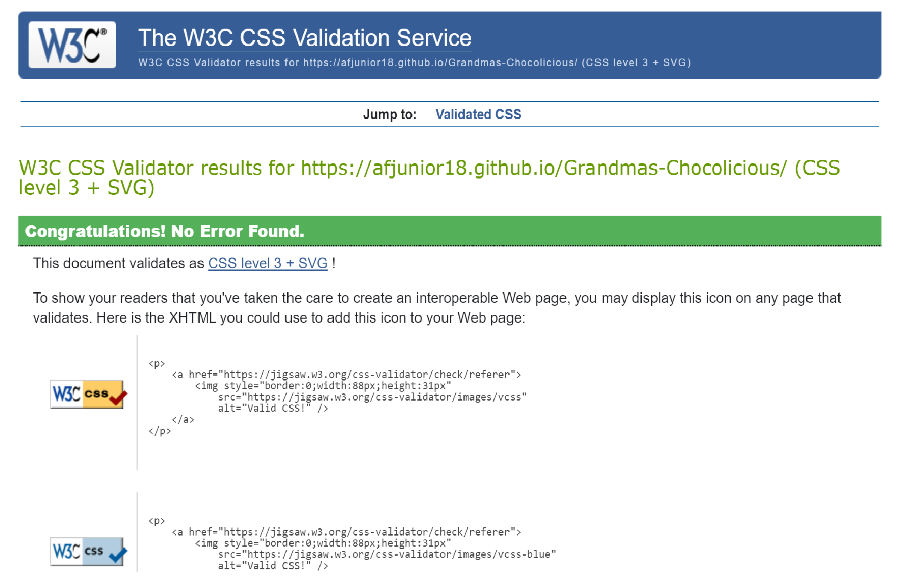

### Lighthouse tool

We used Lighthouse in DevTools to assess and optimize the performance, accessibility, best practices, SEO, and Progressive Web App (PWA) aspects of a web page.

- **Desktop - Index.html**
  
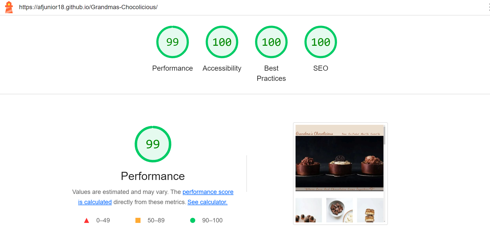

- **Mobile - Index.html**

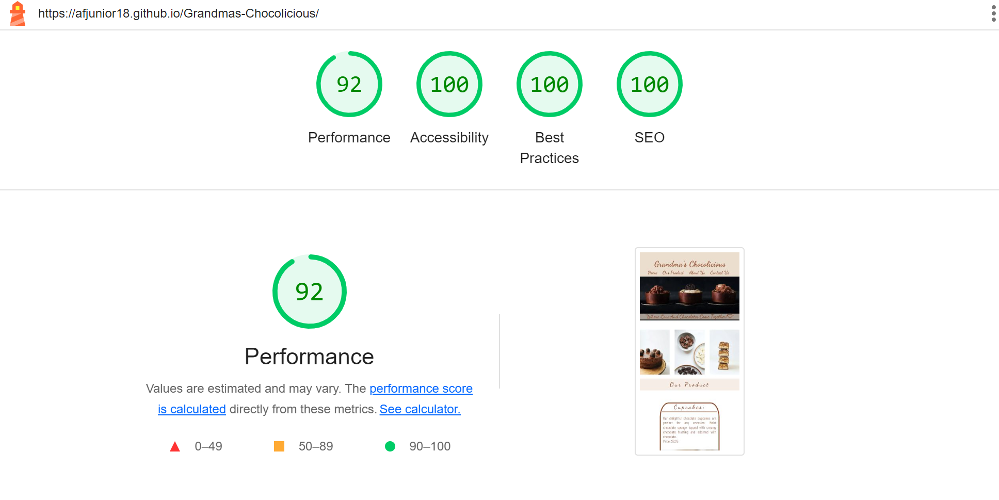

- **Desktop - thank-you.html**
  
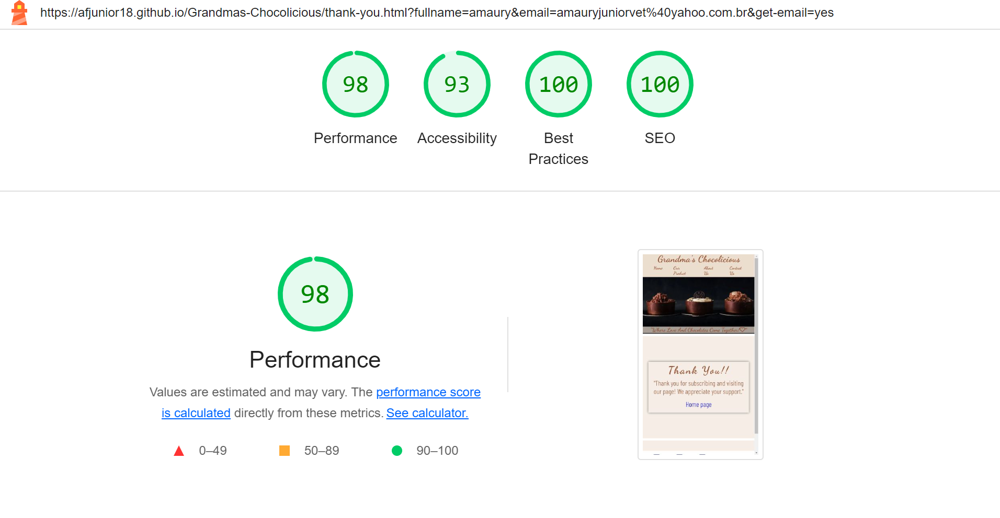

- **Mobile - thank-you.html**

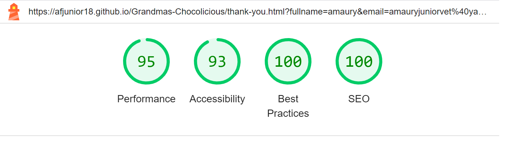

### Wave Validation

- I used the WAVE (Web Accessibility Evaluation Tool) validation to ensure that our website adheres to accessibility standards and guidelines.

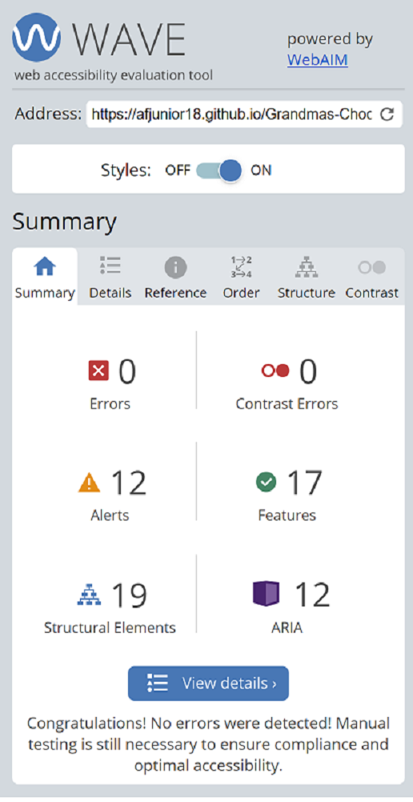

## Deployment

1.**GitHub Account:** Create on account at github.com. The platform is free.

2.**Create Repository:** To start, you'll need a repository to host your website. Click the "+" button on the main page, then "New Repository."

3.**Repository Details:** Name, describe, and set it as public.

4.**Settings:** Access repository settings.

5.**GitHub Pages:** Find this section in settings.

6.**Choose Branch:** Select "main" branch for deployment.

7.**Save:** Save settings to initiate deployment.

8.**Deployment Complete:** Wait for the deployment message.

9.**Access Site:** Get the link to your deployed site.

10.**Share:** Share the link with others.

Explore Deployed Website: Navigate to the live site by clicking on the following link:
https://afjunior18.github.io/Grandmas-Chocolicious/index.html

## Credits

**Acknowledgments**

Special thanks to my mentor [David Bowers](https://github.com/dnlbowers) for their valuable insights and feedback during the development of this project.

To everyone in the Slack community, who directly or indirectly contributed in any way. The well-organized channels that make it easier to seek help regarding code queries, project criteria, README.md, and much more.

## Media and Content

- **Images**

All images used in this project were sourced from [Pexels](https://www.pexels.com/), a platform for free-to-use high-quality images.

- **Icons**

Icons used throughout the site are from [Font Awesome](https://fontawesome.com/), a comprehensive library of icons and symbols.

- **Fonts**

The font styles for this website were selected from [Google Fonts](https://fonts.google.com/), a collection of web-friendly fonts.

- **Tools**

The development process was facilitated by tools such as [Balsamiq](https://www.balsamiq.com/) for wireframing, [GitHub](https://github.com/) for version control, and [Chrome DevTools](https://developers.google.com/web/tools/chrome-devtools) for testing and debugging.
