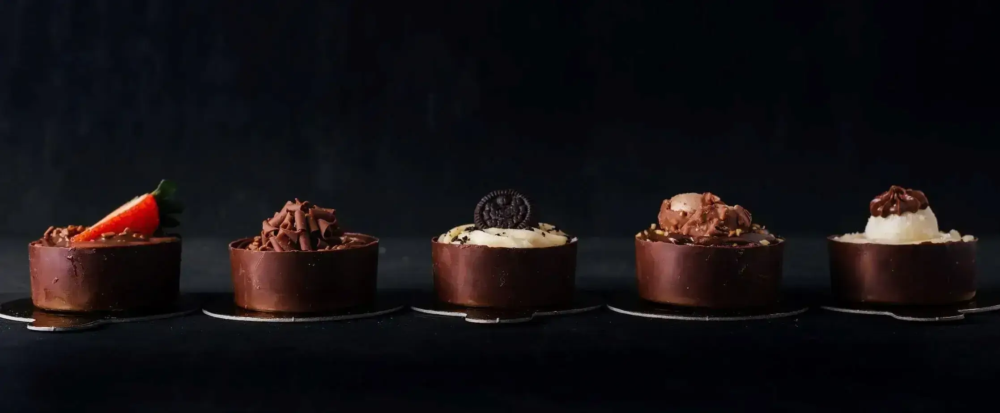

## Grandma’s Chocolicious

**Description**

"Welcome to **Grandma's Chocolicious**, a website made with love for chocolate lovers! Explore a world of irresistible homemade chocolates, handcrafted with care and devotion by a **passionate grandmother**.”

## Project Goal:

In simple terms, my goal is to show my skills in using HTML and CSS to create a website that looks great on any device. I want to impress with a responsive design and a seamless user experience. The website will be a sweet and delightful place that reflects the passion of a grandmother for chocolates.

## User Experience (UX) Development

**New User:**

- Easy Navigation: I want to explore the website effortlessly and quickly find information about the grandmother's delightful chocolates and treats.
- Online Chocolate Experience: I'm eager to enjoy the delectable chocolates online through a seamless and delightful virtual experience.
- Discover More: I want to know more about the grandmother's love for chocolates, her unique recipes, and the story behind her passion.
- Sign Up for Sweet Surprises: I'm excited to sign up and receive updates about new chocolate creations, limited editions, and special discounts.
- Connect on Social Media: I wish to connect with the website's social media platforms to stay updated on the latest chocolate surprises and events.

**Returning Users:**

- Discover Chocolates: Learn about a variety of delicious chocolates crafted with love by the grandma.
- Contact Us: Easily get in touch with the chocolate grandma for any questions or feedback.

**Target Audience:**

This website is for all chocolate enthusiasts, especially those who adore homemade chocolates made with love by a passionate grandmother. It welcomes people of all ages who appreciate the art of chocolate-making and the joy of savoring delightful treats.

## Design choices

**Typography**

- Headings:  the font type chosen was: font-family: 'Dancing Script', cursive, sans-serif;

(image font01)

- Body: the font type selected was: font-family: 'Barlow Condensed', sans-serif;
(image font02)

Both styles through https://fonts.google.com

I made sure the fonts on the website go together well by using the website [https://www.fontpair.co/all]. This tool helped me choose fonts that work nicely together, making the site look better.

**Colour Scheme**

The website, centered around the theme of a chocolate-loving grandmother. The colors #8d4925 and rgba(237, 222, 207) were chosen to resonate with the essence of content.

I choose the rgba(237, 222, 207) color scheme, adjusting the opacity in the range of 0.5 to 1 to achieve the most suitable visual outcome.
These colors work together to bring our website to life, reminding users of the joy of sharing delicious chocolates and the warmth of family connections.

[https://paletadecolores.online/en/html-colors/brown/]
[https://www.canva.com/pt_br/aprenda/cores-para-sites-50-paginas-impactantes/]

**Imagery**
All the pictures were picked to match the theme of the website. The images were chosen from free image using the website [www.pexels.com](http://www.pexels.com/).
